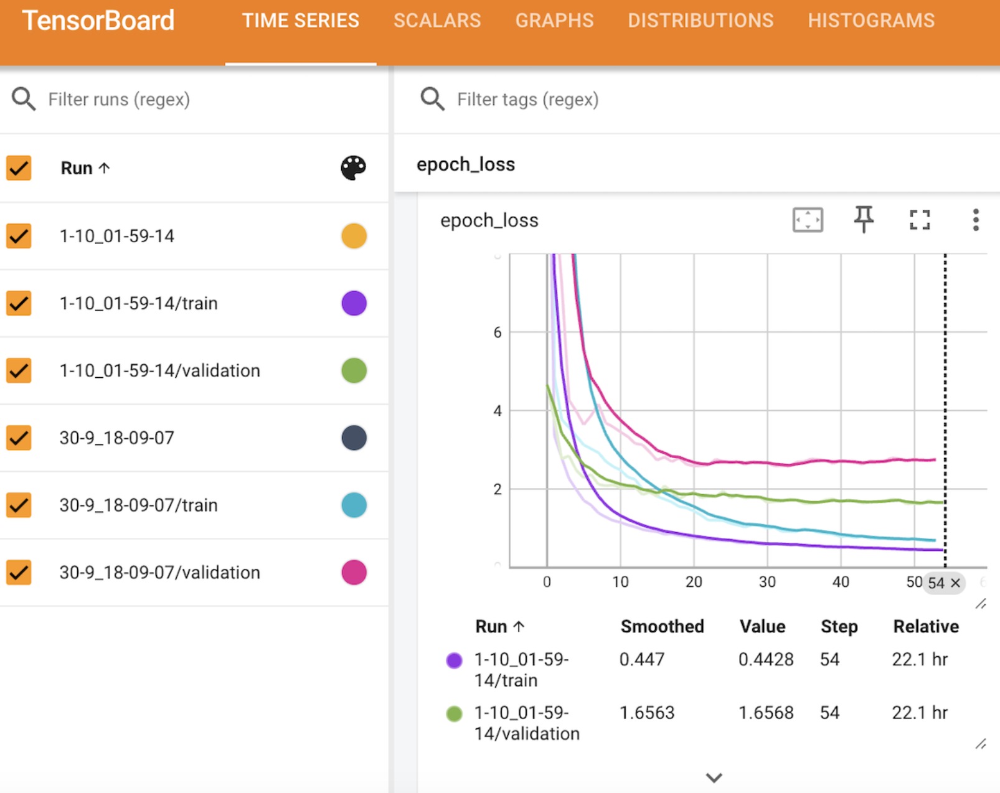

# Dormouse Detection
### Detecting Dormice with Object Detection and Transfer Learning

This repository contains a machine learning pipeline for training an object detection model to identify hazel dormice (Muscardinus avellanarius) in images. Additionally, the dataset is provided in `dormouse-detection/training_data` and a pre-trained model is downloadable from [Releases](https://github.com/fay3000/dormouse-detection/releases). 

The model architecture uses transfer learning from a YOLOv8 model pre-trained on the ImageNet dataset. 

The Dormouse Detection Dataset in this project was created by downloading images from [iNaturalist](https://www.inaturalist.org/) and annotating them with [CVAT (Computer Vision Annotation Tool)](https://github.com/cvat-ai/cvat).

 🔧 Built with Keras and TensorFlow.


### Prediction Results


## Project Structure 
```
dormouse-detection/
├── data_downloader/          # Scripts for downloading data
├── logs/                     # Training logs and metrics
├── plots/                    # Visualisation of results
├── src/                      # Source code for the pipeline
│   ├── __init__.py
│   ├── data_loader.py        # Handles data loading and preprocessing
│   ├── logger.py             # Logging
│   ├── metrics_callback.py   # Model performance metrics computed during training
│   ├── model.py              # Model architecture
│   ├── training_pipeline.py  # Training and evaluation
│   ├── utils.py              # Utility functions
├── tests/                    # Unit testing
├── trained_models/           # Saved trained models
├── training_data/            # Training dataset
├── .gitignore                
├── config.py                 # Configuration for model training and hyperparameters
├── inference.py              # Script for running inference with trained models
├── main.py                   # Main entry point for training
├── poetry.lock               
├── pyproject.toml            
└── README.md                 
```


## Setup and Installation

1. Create a virtual environment using Conda.

```shell
# Create the environment
conda create --name env python=3.9.6

# Activate the environment
conda activate env
```
2. Install Poetry and project dependencies.
```shell
# Install Poetry
pip install poetry
```

```shell
# Install dependencies
poetry install
```

## Pre-trained Model

In addition to training your own model using the instructions in the [Training](#training) section, a pre-trained model for those who wish to directly use it for inference without going through the training process is available.

You can download the `.keras` model file from the [Releases](https://github.com/fay3000/dormouse-detection/releases) section.

## Training
To train the model, use the main.py as the entry point:

```bash
python main.py
```
This will load configuration parameters from config.py and start the training process, saving models and logs in their respective directories.
After training completes, the test set predictions are visualised and saved to `/plots`.


To view the training performance on Tensorboard:
```bash
tensorboard --logdir=logs/fit 
```
<p align="center"></p>

## Inference
For running inference on new images using a trained model:

```bash
python inference.py --model_path trained_models/model_name.keras --image_path path/to/image.jpg
```

Or, to predict all images in a folder:
```bash
python inference.py --model_path trained_models/model_name.keras --image_dir path/to/dir
```

## Dormouse Detection Dataset
#### Composition
  
- **Positive Examples:** 214 images of hazel dormice, each with bounding box annotations. The annotation class ID for hazel dormice is 0.
  
- **Negative Examples:** 232 images of various non-target species with bounding box annotations. The breakdown is as follows:
  - Common shrew: 22 images
  - Grey squirrel: 26 images
  - Wood mouse: 81 images
  - Domestic cat: 103 images
  
  All non-target species are annotated with class ID 1.


#### File Format
The training data is organised in the `training_data/` directory and follows the YOLO annotation format, which includes:

- **Images**: All images are in .jpg format.
- **Annotations**: Corresponding .txt annotation files for each image. These annotation files use the YOLO format with the following structure:
```
class_id  rel_centre_x  rel_centre_y  rel_width  rel_height
````
Relative values are normalised between 0-1, with 1 representing the entire length of the image in the corresponding dimension.

- class_id: An integer representing the class of the detected object.
- rel_centre_x, rel_centre_y: The relative centre coordinates of the bounding box, between 0-1.
- rel_width, rel_height: The relative width and height of the bounding box, between 0-1.

#### Train-Test Split
- The dataset is split into training and test sets with a ratio of 90/10.
- The validation set used for calculating early stopping is the same as the test set due to limited data availability.

#### Augmentation
If data augmentation is enabled in the config.py, the training set is duplicated 5 times with the following augmentations applied:
horizontal-flip, jittered-resize.

## Contact
Email: fbennedik1@gmail.com.
